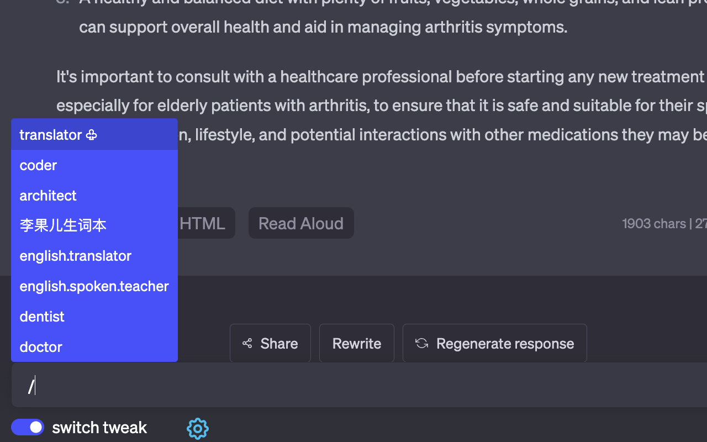

# ChatGPT Tweak

#### 1 Install

[][link-chrome]

#### 2 Why do we need ChatGPT Tweak？

##### 1 Main Features

1. **Customizable prompts**: Each time a message is sent, it can be accompanied by a selected prompt to prevent ChatGPT from getting carried away.
2. **Quickly switch between message history**: Pressing the up and down arrow keys (↑↓) in the input box can switch between message history, making it easy to adjust and resend messages.

##### 2 Tips

1. Limited command support: Enter `command` and press `Enter` means executing the command instead of sending a message to ChatGPT. Supported commands include:
   1. help: Print the help tips.
   2. history: Print the recent message list.
2. History command expansion: Similar to Linux shell, typing `!56` and pressing `Enter` can quickly input the 56th history command.
3. When the input focus is not in the textarea, pressing `Enter` quickly gives the textare input focus.
4. UI interface supports Chinese and English.

---

Like this free project? Please consider [supporting me](https://www.buymeacoffee.com/lixianmin) to keep it running.

If you have any suggestions or ideas, you can contact the author through WeChat (`panda-unique`) or email: `lixianmin#gmail.com` (Please replace the symbol # with @)

